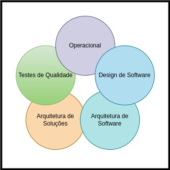

# Conceitos e Fundamentos sobre qualidade de software

 
 

Esse material servirá como um guia sobre os seguintes assuntos: DDD, Arquitetura, Design e Testes de Software, 
Arquitetura de Soluções e Boas práticas quando o assunto for relacionado a implantações de aplicações.

Um bom software é composto pela perfeita junção entre os seguintes pilares:

    

- #### Arquitetura de Soluções
  - Pilar responsável pelo desenho da solução como um todo, as integrações feitas entre os serviços e tecnologias.
    - Pilar muito importante para o sucesso e bom funcionamento da solução como um todo.
    - Nesse pilar é onde encontramos fundamentos como <b>Resiliência</b>, <b>Performance</b>, <b>Escalabilidade</b>, <b>Consistência</b>, <b>Disponibilidade</b> e <b>Sustentabilidade Financeira.</b>
    - Muitos problemas de determinado produto as vezes estão na forma que ele foi arquitetado e não em como foi desenvolvido.
    - Nesse pilar é onde lidamos também com o seguintes assuntos: <b>DDD</b> e <b>Event Storming</b>, pois com eles podemos: 
      - Definir uma linguagem ubiqua do produto, levantar os dominios e identificar eventos dos mesmos.
      - Mapear quais são os limites dos contextos e quem são os envolvidos.

- #### Arquitetura de Software
  - Pilar responsável pela a parte estrutural da aplicação, é nele que organizamos como vai ser desenvolvido o sofware.
    -  Nesse pilar lidamos com <b>Clean Architecture</b> e <b>Onion Architecture</b> (Arquitetura em camadas)

- #### Design de Software
    - Pilar responsável pela forma que será desenvolvido o software como um todo
      - Nesse pilar lidamos com <b>Design Hexagonal</b>, <b>Clean Code</b> e <b>Design Patterns</b>.
  
- #### Testes de Qualidade
    - Pilar responsável pela garantia da qualidade do software, muitas das vezes é ignorado e substimado
      - Muitos desenvolvedores ignoram esse pilar, por achar perda de tempo ou até mesmo por falta de interesse em se aprofundar no assunto.
      - Nesse pilar lidamos com <b>Testes unitários</b>, <b>BDD</b>, <b>TaaC</b>, <b>Testes Funcionais</b> e <b>Testes de Performance.</b>
      
- #### Operacional
    - Pilar responsável pela condução da aplicação até os ambientes de Testes e Produção assim como sua Sustentação no decorrer do tempo. 
      - Nesse pilar lidamos com <b>12 Factors</b>, <b>CI/CD</b>, <b>Implantações de serviços</b> e <b>Sustentação.</b>

