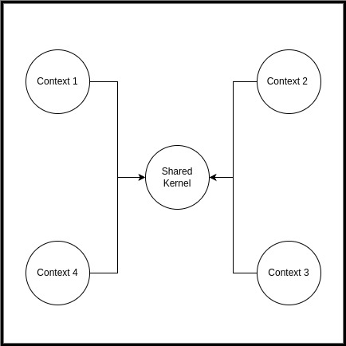
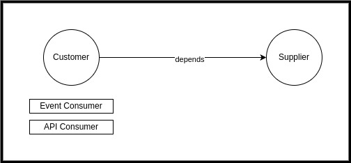
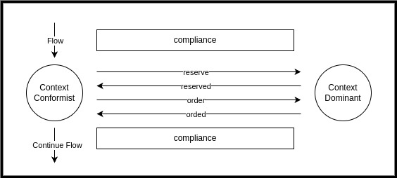
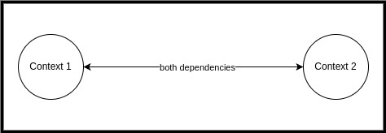
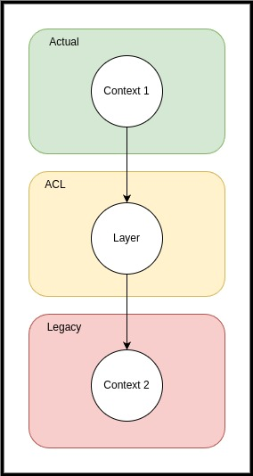

# DDD - Patterns de relacionamento entre bounded contexts

Existem diversos patterns que descrevem o tipo de relacionamento entre os bounded contexts:

- <b>Shared Kernel</b>

  Um contexto compartilhado entre outros contextos, o shared kernel é um tipo de
contexto onde N bounded contexts dependem dele, uma espécie de Core, este tipo de 
contexto não pode ser alterado sem consultar todos os times de desenvolvimento que 
dependem dele.

    

- <b>Customer/Supplier</b>

    Contextos customer dependem de contextos supplier.
A equipe downstream atua como cliente (customer) da equipe upstream (supplier).
As equipes definem testes de aceitação automatizados que validam as interfaces 
que a equipe upstream fornecem. A equipe upstream pode então fazer alterações em
seu código sem medo de quebrar alguma coisa da equipe downstream.

    

 - <b>Conformist</b>

    É o cenário onde as equipes downstream e upstream não estão mutuamente alinhadas e a 
equipe downstream precisa atender o negócio com o que a equipe upstream fornece mesmo 
não estando de acordo com as necessidades. A equipe downstream precisa aceitar este 
fato, se conformar com isto.

    

 - <b>Partner</b>

   Neste cenário duas equipes possuem dependências mútuas em seus contextos e precisam somar
esforços de modelagem para se atenderem mutuamente.

    

 - <b>Anti Corruption Layer</b>

   Neste cenário a equipe downstream desenvolve uma camada adicional anti-corrupção
para se comunicar com o contexto upstream, é o cenário típico onde o supplier é
um sistema legado ou uma API mal desenvolvida.

    

